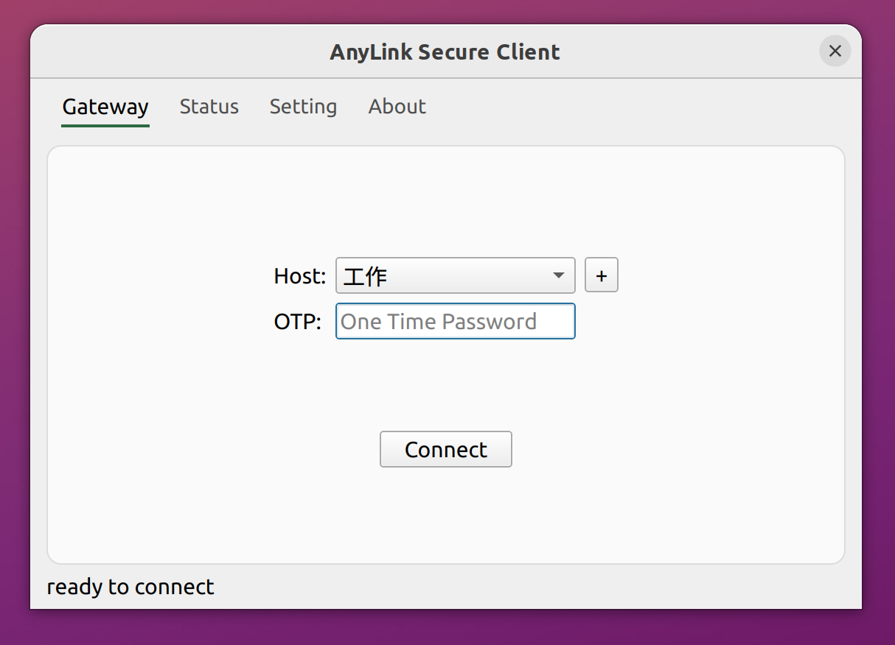

> 动态域名分流使用[说明](./DynamicSplitTunneling.md)

## AnyLink Secure Client

This is an SSL VPN client that supports OpenConnect or Cisco's AnyConnect [SSL VPN Protocol](https://datatracker.ietf.org/doc/html/draft-mavrogiannopoulos-openconnect-03).  It use [sslcon](https://github.com/tlslink/sslcon) as the core to communicate with the server.

Currently the following servers are supported,

- [AnyLink](https://github.com/bjdgyc/anylink)
- [OpenConnect VPN server](https://gitlab.com/openconnect/ocserv)

> This software can save passwords(optional) in the Keychain of the operating system, but you should evaluate whether your usage scenarios allow saving passwords and avoid potential security risks.
>

## Screenshot



## Download

- Fork this project and compile it using github action
- Join the QQ group by donating to the project
- You may be able to find releases from other forks

### Windows

Please use Windows 10 or newer.

### macOS

- No App Store version
- Not digitally signed or notarized by Apple

Due to the above reasons, it is only recommended for users with certain macOS system experience.

You can use the `wget` or `curl` command to download the dmg file. If you use a web browser to download the file, please execute the following command,


```bash
xattr -r -d com.apple.quarantine anylink-*.dmg
```

Then mount the dmg file and double-click the installer to install it. During the installation process, you need to grant root permissions to the software.

> For the arm64 version, the current installer requires Rosetta to run, but the installed program is native on the Apple silicon platform.

### Linux

You should use `anylink-linux-amd64.tar.gz` with Ubuntu 20.04 or newer.

```bash
tar -zxvf anylink-*.tar.gz
```

Double-click the `.run` file to install the software. The `.run` package is supposed to support other Linux distributions like RedHat, however, you may need to follow the prompts to install some dependencies.

## UnInstall

Enter the installation directory and execute the uninstall program.

## Help

| You may want to join in the QQ Group(66899589) to get some help. |
| :----------------------------------------------------------: |
|        |
